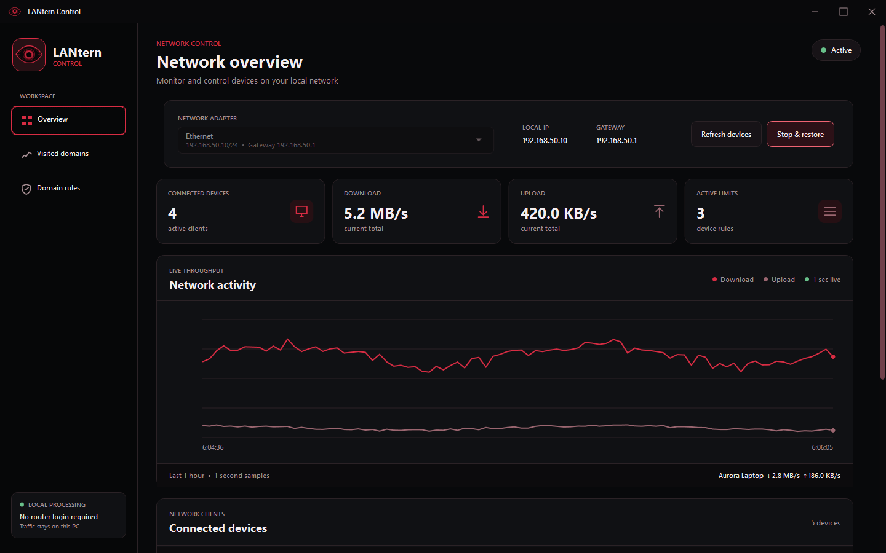
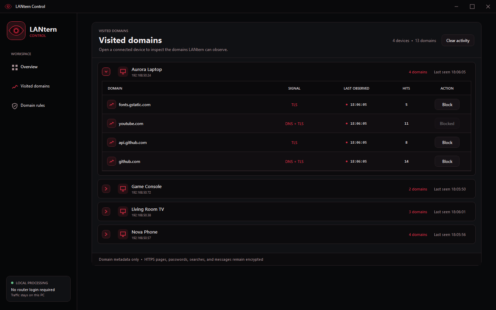
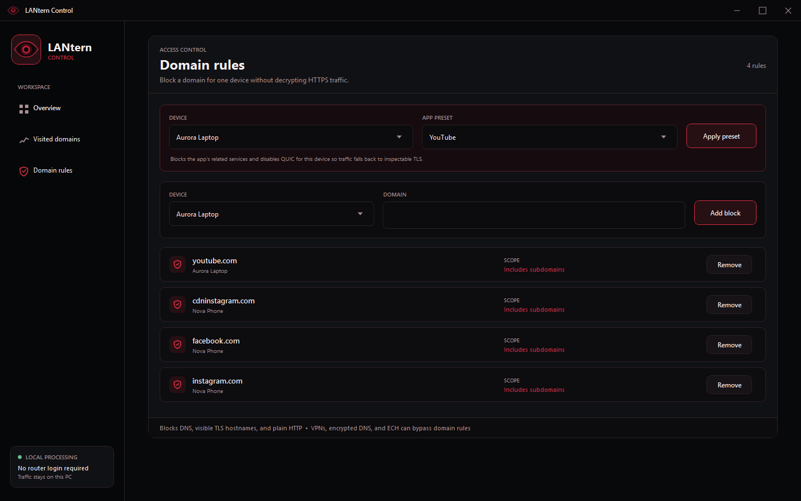

<p align="center">
  
</p>

# LANtern Control

<a href="https://github.com/humane125/LANtern-Control/releases/latest"></a>
<a href="LICENSE"></a>


LANtern Control is a router-independent Windows application for discovering,
monitoring, and managing devices on a local IPv4 network. It provides
SelfishNet-style bandwidth controls through a modern desktop interface without
requiring access to the router's administration dashboard.

> [!IMPORTANT]
> LANtern Control is currently available for Windows. **Linux and macOS are
> works in progress (WIP).**

## Features

- Discover devices connected to the same Ethernet or Wi-Fi network.
- Resolve device names using DHCP, reverse DNS, NetBIOS, and mDNS information.
- Remember device names, aliases, and rules between application launches.
- Display live per-device download and upload speeds.
- Keep a one-hour network activity chart with one-second samples.
- Apply independent download and upload limits in `KB/s`.
- Pause and restore a device's IPv4 internet connection.
- Observe domains through DNS queries, TLS server names, and plain HTTP host
  headers without decrypting private HTTPS content.
- Block domains for individual devices, including presets for common services.
- Restore normal client and router ARP mappings when control stops.
- Check GitHub Releases for optional application updates.
- Choose between an installer and a portable executable.

## Screenshots

The screenshots below use synthetic demo data and do not contain information
from a real network.

### Network overview



### Visited domains



### Domain rules



## Requirements

- Windows 10 or Windows 11, x64.
- Administrator access.
- [Npcap](https://npcap.com/#download) installed on the controller computer.
  WinPcap API-compatible mode is recommended for compatibility.
- The controller computer and target devices must be on the same IPv4 broadcast
  network.
- A stable network connection. Ethernet is recommended; if Wi-Fi is used, keep
  the controller close enough to the router for a strong signal.

LANtern Control does not include or redistribute Npcap. Install Npcap separately
from its official website, then restart LANtern Control.

## Installation

Download the latest version from [GitHub Releases](https://github.com/humane125/LANtern-Control/releases/latest).

### Installer

1. Download `LANtern-Control-Setup-v0.1.1.exe`.
2. Run the setup program.
3. Choose the installation folder and whether to create Start Menu or desktop
   shortcuts.
4. Launch LANtern Control and accept the Administrator prompt.

### Portable version

1. Download `LANtern-Control-v0.1.1.exe`.
2. Place it in a folder where it can remain.
3. Run it as Administrator. No application installation is required.

## How to use

1. Launch LANtern Control as Administrator.
2. Select the network adapter whose local IP address and gateway match the
   network you want to manage.
3. Click **Start control** and wait for connected devices to appear.
4. Click **Refresh devices** when you want to run a fresh discovery scan.
5. Enter a download or upload limit in `KB/s`. A value of `0` means unlimited.
6. Use the **Internet** switch to pause or restore a device's connection.
7. Open **Visited domains** to inspect the destination domains LANtern can
   observe for each device.
8. Add individual domain rules or use a service preset to block domains for a
   selected device.
9. Click **Stop & restore** before changing adapters, leaving the network, or
   shutting down the controller computer.

Settings, saved device identities, and rules are stored locally in:

```text
%LOCALAPPDATA%\LANternControl\settings.json
```

No router username or password is required, and LANtern does not permanently
change the router configuration.

## Domain visibility and blocking

LANtern can identify many destination domains, but it does not decrypt HTTPS,
read searches, inspect messages, or view private page contents. Domain blocking
is best effort because applications may use cached connections, several CDN
domains, or encrypted protocols.

The following can hide domains or bypass domain-based rules:

- VPNs, Tor, and proxy applications.
- Encrypted DNS such as DoH or DoT.
- TLS Encrypted Client Hello (ECH).
- QUIC/HTTP3 and cached or already-open connections.
- Applications that use direct IP addresses or frequently changing domains.

## Network compatibility

LANtern operates on the local IPv4 network rather than through a router-specific
API, so it can work with many ordinary home routers. It cannot be guaranteed on
every network or adapter.

- IPv6 traffic is not controlled in this release.
- Guest Wi-Fi or client isolation can prevent discovery and control.
- Dynamic ARP inspection or other ARP protection can block interception.
- Devices behind another router or NAT are not on the same broadcast LAN.
- Some Wi-Fi drivers do not reliably support packet capture or injection.
- While a device is redirected, the controller computer becomes part of its
  traffic path. A weak controller connection can reduce speed or increase
  latency for that device.
- The controller must remain awake and connected while rules are active.

## Troubleshooting

### Npcap is not detected

Install the latest version from the [official Npcap download page](https://npcap.com/#download),
enable WinPcap API-compatible mode if offered, and restart LANtern Control.

### Devices do not appear

- Confirm that the correct adapter is selected.
- Make sure the controller and devices are on the same normal LAN, not an
  isolated guest network.
- Run LANtern Control as Administrator.
- Click **Refresh devices** and allow the discovery scan to finish.

### A device loses connectivity

Click **Stop & restore** and wait for the application to repair the normal ARP
mappings. If connectivity does not return, reconnect the affected device to
Wi-Fi or disable and re-enable its network adapter.

## Building from source

The Windows application requires the .NET 8 SDK. Inno Setup 6 is also required
to produce the setup executable.

```powershell
dotnet test .\tests\Lantern.Core.Tests\Lantern.Core.Tests.csproj
dotnet test .\tests\Lantern.App.Tests\Lantern.App.Tests.csproj
.\scripts\publish.ps1
```

The publishing script creates the portable application and installer in the
`outputs` folder.

## License

LANtern Control is open-source software released under the [MIT License](LICENSE).

## Responsible use

Use LANtern Control only on networks and devices that you own or are authorized
to administer. Pausing, limiting, monitoring, or blocking another person's
traffic without permission may violate policies or local laws.

## Feedback and bug reports

If you find a problem, [open a GitHub issue](https://github.com/humane125/LANtern-Control/issues)
and include the LANtern version, Windows version, adapter type, Npcap version,
router model, and steps needed to reproduce it.

---

**This project was vibecoded so you can expect bugs please leave an issue if you find any**
